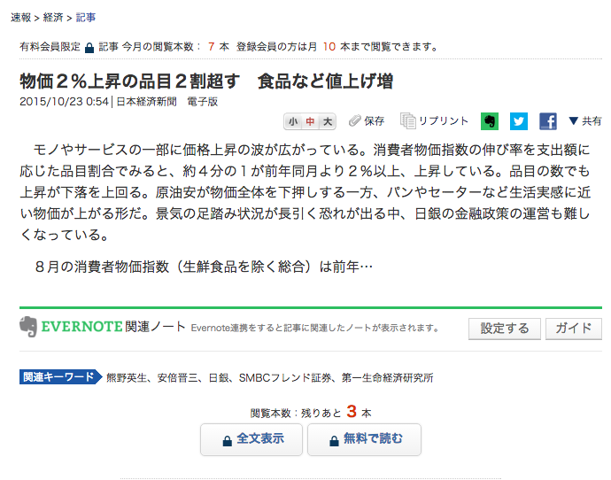
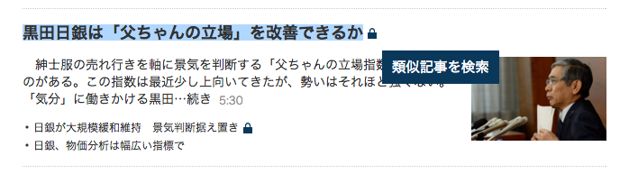

# nikkei-hacker

## 概要

nikkei-hacker(日経ハッカー)は、<a href="http://www.nikkei.com/" target="_blank">日本経済新聞</a>有料記事を無料で読むことができるChrome拡張アプリです。実際には、類似記事をGoogleから簡単に検索することができます。

## 使い方

### ①有料記事のページヘゆき、`全文表示`の隣に出現した`無料で読む`ボタンを押しましょう。



### ② 記事タイトルを選択し、出現した`無料で読む`ボタンを押すことで、`http://www.nikkei.com`上のすべてのページで使用することもできます。



## インストール

```bash
git clone https://github.com/okmttdhr/nikkei-hacker.git && cd nikkei-hacker
```

`config/secret.js`に以下の様なファイルを作成してください。`あなたのappid`は<a href="https://e.developer.yahoo.co.jp/register" target="_blank">こちら</a>から発行できます。

```javascript
// config/secret.js

const config = new Map();
config.set('appid',  'あなたのappid');
export default config;
```

作成したら、以下を実行してください。

```bash
npm run build
```

以下の、`ステップ 2: アプリをテストする`に従い、`パッケージ化されていない拡張機能`を読み込んでください。

* <a href="https://support.google.com/chrome/a/answer/2714278?hl=ja" target="_blank">チュートリアル: Chrome アプリを作成する - Chrome for Work ヘルプ</a>
